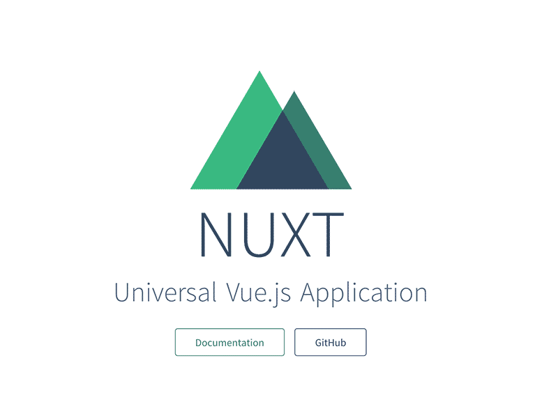
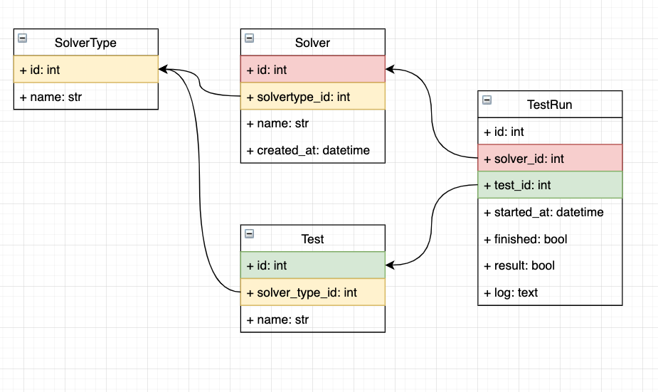

# Petrushka Project


### Main Stack:
    
- Backend:
    - Python
    - Framework: Flask
- Frontend:
    - JavaScript
    - Framework: Vue.js + Nuxt


### Этап 1.
#### Устанавливаем и настаиваем окружения для работы.

Back
1. ```python3 -m venv venv ``` Настраиваем виртуальное окружение Python.
2. ```source venv/bin/activate ``` Запускаем виртуальное окружение Python.
3. ```pip install flask ``` Устанавливаем Flask в виртуальное окружение
4. Создаем файл requirements.txt, в который будем вносить все зависимости связанные с проектом.

___

Front
1. Устанавливаем Node JS по интсрукции для своей операционной системы.
[Инструкции здесь](https://nodejs.org/ru/download/package-manager/)
2. Создаем чистый Nuxt Js проект по инструкции из официальной документации.
[Инструкции здесь](https://ru.nuxtjs.org/). <br>
По умолчанию добавляем плагины:
    - Axios.js для отправки http запросов.
    - Vuetify.js - UX/UI фреймворк для помощи в создании приятного интерфейса.
3. ``` npm run dev ``` Проверяем запускается ли проект.
7. Должна появится стартовая страница Nuxt.


### Этап 2.
#### Определяем цели проекта.

1. Создать базу данных для хранения информации.
2. Создать API для наполнения базы данных сторонним микросервисом.
3. Создать API для чтения информации из БД со стороны Frontend.
4. Документировать методы API.
5. Создать меню с выбором таблиц мониторинга.
6. Создать страницы с необходимыми таблицами и дать возможность переключаться между ними через меню.


### Этап 3.
#### Разработка базы данных.

Эскиз схемы БД.


