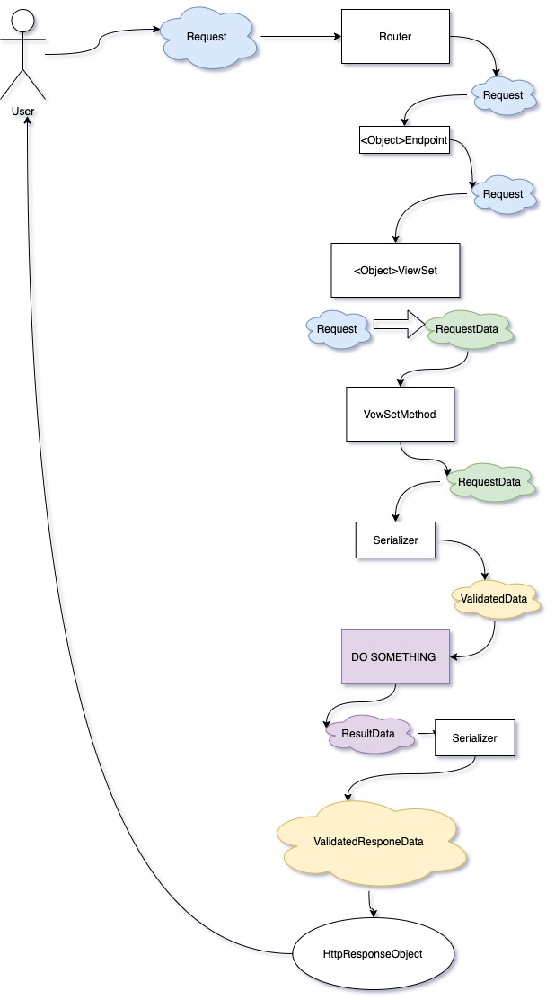

# Petrushka Project


### Main Stack:
    
- Backend:
    - Python
    - Framework: Flask
- Frontend:
    - JavaScript
    - Framework: Vue.js + Nuxt


### Этап 1.
#### Устанавливаем и настаиваем окружения для работы.

Back
1. ```python3 -m venv venv ``` Настраиваем виртуальное окружение Python.
2. ```source venv/bin/activate ``` Запускаем виртуальное окружение Python.
3. ```pip install flask ``` Устанавливаем Flask в виртуальное окружение
4. Создаем файл requirements.txt, в который будем вносить все зависимости связанные с проектом.

___

Front
1. Устанавливаем Node JS по интсрукции для своей операционной системы.
[Инструкции здесь](https://nodejs.org/ru/download/package-manager/)
2. Создаем чистый Nuxt Js проект по инструкции из официальной документации.
[Инструкции здесь](https://ru.nuxtjs.org/). <br>
По умолчанию добавляем плагины:
    - Axios.js для отправки http запросов.
    - Vuetify.js - UX/UI фреймворк для помощи в создании приятного интерфейса.
3. ``` npm run dev ``` Проверяем запускается ли проект.
7. Должна появится стартовая страница Nuxt.


### Этап 2.
#### Определяем цели проекта.

1. Создать базу данных для хранения информации.
2. Создать API для наполнения базы данных сторонним микросервисом.
3. Создать API для чтения информации из БД со стороны Frontend.
4. Документировать методы API.
5. Создать меню с выбором таблиц мониторинга.
6. Создать страницы с необходимыми таблицами и дать возможность переключаться между ними через меню.


### Этап 3.
#### Разработка базы данных.

Эскиз схемы БД.


Для создания таблиц базы данных и работы с ними мы будем использовать простую библиотеку Peewee
[Ссылка на документацию](http://docs.peewee-orm.com/en/latest/peewee/quickstart.html#)

Настройки подключения к базе данных задаются в файле
[config.py](./back/config.py)

Описание моделей находится в файле
[models.py](./back/src/database/models.py)

Перед запуском приложения нам необходимо создать таблицы согласно схеме
Для того, чтобы приложение перед каждым запуском сервера проверяло наличие нуджных таблиц в базе данных и создавало их - добавляем функцию в файл
[app.py](./back/app.py). Прямо перед запуском сервера.
```python
from src.database.models import create_all_tables

create_all_tables()
``` 
База данных готова к работе.


### Этап 4.
#### Разработка и создание API методов.

У нас имеется 4 объекта предметной области и соответственно 4 таблицы в базе данных.
Удобно использовать следующую схему работы с API:

    -GET    /<object>      - список объектов.
    -POST   /<object>      - создание нового объекта, где в теле запроса передается JSON с описанием его полей.
    -GET    /<object>/{id} - получение информации о конкретном объекте по его id.
    -POST   /<object>/{id} - обновить поля объекта по его id, где в теле запроса передается JSON с новыми данными объекта.
    -DELETE /<object>/{id} - удалить объект по id.

Стоит учесть, что записей в базе данных может быть очень много, поэтому для всех запросов на получение списка объектов
добавляем новый параметр "page".
Количество объектов, которые отдаются на странице ограничивается в файле
[config.py](./back/config.py) переметром OBJECTS_PER_PAGE(по умолчанию 20).

Для выбора страницы отправляется параметрический GET запрос: <br>
GET    /<object>?page=n , где n-номер страницы <br>
Результатом работы этого метода будет JSON следующего формата:

```json
{
  "page": 1,
  "total": 1050,
  "objects": [
    {}, {}, {}
  ]
}
```

Созданные эндпоинты можно найти в файле роутера 
[router.py](./back/src/router.py)

### Реализация функционала API методов.

На данный момент у нас имеются точки, в которые призодит запрос пользователя, и есть база данных.
Однако нет слоя, который связывает эти 2 слоя и реализует функционал чтения и записи данных.

Для удобства работы с объектами реализуем новый уровень абстракии ViewSet.
В нем будут собраны все методы, которые можно совершить с объектом(-ами) базы данных.
Для начала создаем базовый интерфейс, который наследуется от класса ABC штатной библиотеки abc python.
Наследование от этого класса обязывает в каждом последующем ViewSet переопределить методы базового класса, 
помеченные декоратором @abstractmethod.
Это должно гарантировать нам существование бащовых методов **list**, **create**, **update**, **retrieve**, **delete** 
в каждом реализованном нами ViewSet.

````python
from abc import ABC, abstractmethod
from src.lib.response import JsonResponse
from flask import request

class BaseViewSet(ABC):

    def __init__(self, request: request):
        self.request = request

    @abstractmethod
    def list(self, page: int = 0) -> JsonResponse:
        pass

    @abstractmethod
    def retrieve(self, id: int) -> JsonResponse:
        pass

    @abstractmethod
    def update(self, id: int) -> JsonResponse:
        return JsonResponse({})

    @abstractmethod
    def create(self) -> JsonResponse:
        pass

    @abstractmethod
    def delete(self, id: int) -> JsonResponse:
        pass
````

В файле [views.py](./back/src/views.py) мы можем ознакомиться со всеми созданными ViewSet. По одному ViewSet для каждой модели.

    - SolverTypeViewSet
    - SolverViewSet
    - TestViewSet
    - TestRunViewSet

Для мримера разберем что происходит внутри одного из ViewSet, который работает с моделью SolverType.
Внутри всех остальных ViewSet все практически идентично...
Что нам дополнительно нужно знать перед рассмотрением следующего кода?

    - Serializer: класс, который валидирует пришедшие в него данныеб принимая dict с параметрами объекта. 
    В дальнейшем можно использовать его как объект с полями или воспользоваться методом .dict(), 
    чтобы вернуть валидированный словарь с данными об объекте.
    - JsonResponse: Надстройка над базовым Flask Response для удобства работы с Json данными. Каждый из методов
    ViewSet должен отдавать именно этот объект, либо непосредственно Flask Response, если возвращаемый ответ 
    будет не JSON. Это тот ответ, который получит пользователь.

---

Вернемся к ViewSet

```python
from src.views import BaseViewSet
from src.lib.response import JsonResponse # Импортируем вспомогательный Json Response.
from src.serializers import (
    SolverTypeSerializer, 
    SolverTypeCreateSerializer,
    SolverTypeUpdateSerializer
) # Испортирем все нужные нам Serializers. Каждый метод требует немного разные обязательные 
# параметры для работы поэтому и Serializer для каждых целей свой
from src.database.models import (
    SolverType
) # Импортируем класс для работы с нужной таблицей базы данных.


class SolverTypeViewSet(BaseViewSet):

    def list(self, page: int = 0): 
        """
        Метод возвращает список объектов SolverType.
        Формат:
        {
            "total": total_count, # Общее количество объектов SolverType в БД.
            "page": page,  # Запрошенная страница.
            "objects": []  # Список найденных объектов(Пустой список, если их нет или превышено кол-во страниц)
        }
        """
        models = SolverType \
            .select() \
            .offset(page * self.PAGE_SIZE) \
            .limit(page * self.PAGE_SIZE + self.PAGE_SIZE) # Запрашиваем в БД нужные нам объекты.
        total_count = SolverType.select().count() # Запрашиваем в БД общее количество объектов.
        output_list = [] # Создаем пока пустой список с объектами для Response.
        for model in models: #  Проходим по каждому объекту, которые вернула нам БД.
            serializer = SolverTypeSerializer(**model.__data__) # Заполняем Serializer данными из БД.
            output_list.append(serializer.dict()) # С помощью Serializer превращаем каждый в dict и добавляем в output_list
        return JsonResponse({
            "total": total_count,
            "page": page,
            "objects": output_list
        }) # Возвращаем результат в виде JsonResponse

    def retrieve(self, id: int) -> JsonResponse:
        """
        Метод возвращает данные об одном объекте SolverType по его id.
        """
        model = SolverType.get(id=id) # Получаем объект из БД по id.
        serializer = SolverTypeSerializer(**model.__data__)  # Заполняем полученными данными Serializer
        return JsonResponse(serializer.dict()) # Получаем от Serializer словарь и возвращаем его как Json Response

    def update(self, id: int) -> JsonResponse:
        """
        Метод обновляет данные одного объекте SolverType по его id.
        """
        model = SolverType.get(id=id) # Получаем объект из БД по id.
        serializer = SolverTypeUpdateSerializer(**self.request_data) # Заполняем полученными данными Serializer
        # Следующий цикл проходит по каждому элементу Serializer и обновляет его данными объект БД.
        for key, value in serializer.dict().items(): 
            setattr(model, key, value)
        model.save() # Сохраняем обновленную модель БД.
        updated_model_serializer = SolverTypeSerializer(**model.__data__) # Заполняем данными обновленного объекта БД Serializer.
        return JsonResponse(updated_model_serializer.dict()) # Возвращаем обновленную модель как Json Response

    def create(self) -> JsonResponse:
        """
        Метод создает новый объект SolverType в БД.
        """
        serializer = SolverTypeCreateSerializer(**self.request_data) # Заполняем данными в запросе Serializer.
        model = SolverType.create(**serializer.dict()) # Пользуемся методом объекта БД .create(), распаковывая в него словарь, полученный из serializer.
        # Примечание. Подробнее про распаковку *args и **kwargs можно почитать тут 
        # https://pyneng.readthedocs.io/ru/latest/book/09_functions/func_unpacking_args.html
        created_model_serializer = SolverTypeSerializer(**model.__data__) # Созданный объект передаем в нужный Serizlizer
        return JsonResponse(created_model_serializer.dict())  # И возвращаем пользователю созданный объект.

    def delete(self, id: int) -> JsonResponse:
        """
        Метод удаляет объект SolverType из БД по его id.
        """
        return JsonResponse({})
```

В итоге мы получаем следующий маршруд движения Запроса пользователя

   
